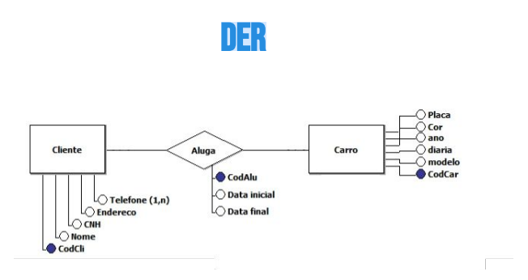

###Modelagem Conceitual

- Deve ser independente de processos de negócios, acesso aos dados e formas de consulta ou manuntenção, focando na representação lógica dos dados.

- Principais elementos: 
    - Entidades;
    - Atributos;
    - Relacionamentos;

- Representações

    ###DER ( DIAGRAMA DE ENTIDADE - RELACIONAMENTO)
        - Entidade: Uma existência independente;
        - Atributo: Propriedades que descrevem entidades;
        - Relacionamento: Associação entre as entidades;
        
        