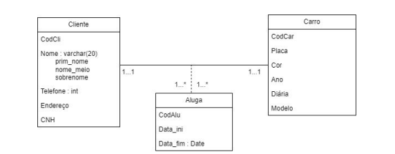

#Modelagem Conceitual

- Deve ser independente de processos de negócios, acesso aos dados e formas de consulta ou manuntenção, focando na representação lógica dos dados.

- Principais elementos: 
    - Entidades;
    - Atributos;
    - Relacionamentos;

- Representações

    #DER ( DIAGRAMA DE ENTIDADE - RELACIONAMENTO)
        - Entidade: Uma existência independente;
        - Atributo: Propriedades que descrevem entidades;
        - Relacionamento: Associação entre as entidades;
        
        

    #MER ( MODELO ENTIDADE - RELACIONAMENTO )
        - Modelo conceitual que ajuda na representação de relações entre diferentes elementos.

    #UML ( UNIFIED MODELING LANGUAGE )
        - É uma linguagem padrão para modelar sistemas, especialmente em desenvolvimento de software. Ela usa diagramas visuais para representar estruturas, comportamentos e interações de um sistema.

        
    
    #MODELAGEM LÓGICA
        - Etapa intermediária entre o modelo conceitual e a implementação no banco de dados. Transforma entidades e atributos em tabelas, colunas e chaves primárias/estrangeiras.

        #CHAVES:
                - PRIMARIA: Identificador único de uma tabela.
                - Estrangeira: Referência a chave PRIMARIA de outra tabela.
                - CANDIDATA: Candidatas a chaves PRIMARIAS
        

    #Classificação de entidades
        - FORTE: Independente, possui chave primária própria.
        - FRACA: Depende de uma forte, não tem chave primária própria.
    
#CARDINALIDADE
    - Cardinalidade é usada para descrever a quantidade de associações possíveis entre as instâncias de duas entidades em um relacionamento. Basicamente, ela determina “quantos” elementos de uma entidade se relacionam com elementos da outra.
    
        - TIPOS:
                -(1:1): Uma instância de entidade está relacioando com apenas 1 instância de entidade. Por exemplo: Uma pessoa pode ter apenas um passaporte e um passaporte só pode ter um unico dono ( pessoa ).
                -(1:N): Uma instância de uma entidade pode se relacionar com N instâncias de outra entidade. Por exemplo: Um autor de livro pode ter varios livros, mas um livro pode ter apenas um autor.
                -(N:M): Varias instância de uma entidade pode se relacionar com varias instâncias de outra entidade. Por exemplo: Um aluno pode se matricular em varias disciplinas e as disciplinas podem ter varios alunos.

#NORMALIZAÇÃO
    - A normalização é um processo de organização de dados em um banco relacional para eliminar redundâncias, melhorar a consistência e garantir a integridade dos dados. O principal objetivo é reduzir problemas como anomalias de inserção, atualização e exclusão, garantindo um armazenamento eficiente.

    - BENEFÍCIOS DA NORMALIZAÇÃO:
                                -Evita redundância de dados, economizando espaço de armazenamento.

                                -Melhora a integridade e consistência das informações.

                                -Facilita a manutenção do banco de dados.

                                -Reduz a chance de erros e inconsistências nos registros.

                                -Otimiza consultas e atualizações, tornando o sistema mais eficiente.
    TIPOS:
        -Primeira Forma Normal (1FN): Garante que cada campo tenha valores atômicos (sem listas ou grupos repetitivos).

        -Segunda Forma Normal (2FN): Elimina dependências parciais, garantindo que os atributos dependam completamente da chave -primária.

        -Terceira Forma Normal (3FN): Remove dependências transitivas, onde um atributo depende de outro que não é chave primária.

        -Forma Normal de Boyce-Codd (FNBC): Aperfeiçoa a 3FN, evitando dependências funcionais indevidas.

        -Quarta e Quinta Formas Normais (4FN e 5FN): Eliminam redundâncias mais complexas.